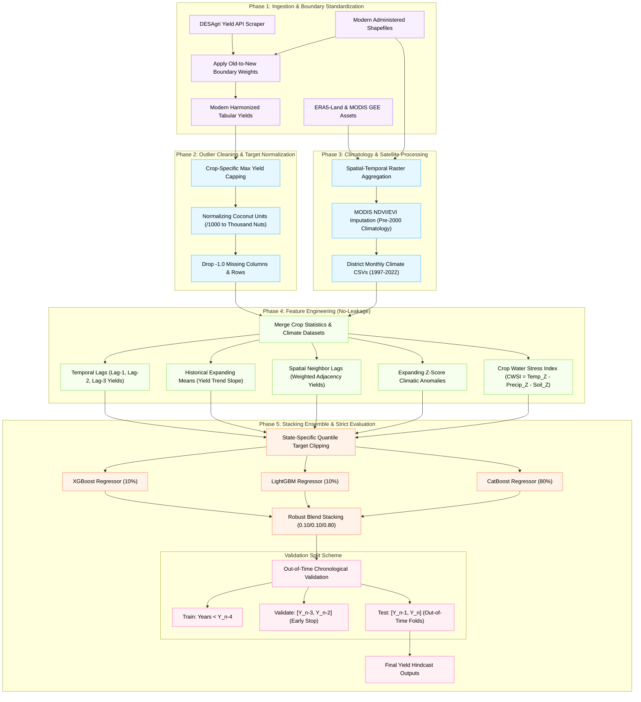

# TERRA: Regional Crop Yield Hindcasting Engine Methodology

This document details the step-by-step methodology and architectural flow of the **TERRA (Regional Yield Hindcasting Engine)**. 

The pipeline is designed to ingest multi-source agronomic statistics and climate datasets, clean and harmonize administrative boundaries, engineer leakage-free spatial-temporal features, and execute a robust stacking ensemble evaluated under strict chronological cross-validation.

---

## Technical Methodology Flowchart

---

## Architectural Breakdown

### 1. Ingestion & Boundary Standardization
* **Yield API Scraper**: Crolls the government DESAgri APY Portal to collect historical crop production, area, and yield metrics (1997-2022).
* **Boundary Weights Harmonization**: Corrects for administrative changes (e.g., district splits or reorganizations). Yield statistics from older boundaries are reallocated using verified spatial boundary weights to ensure consistency.

### 2. Cleaning & Normalization
* **Outlier Capping**: Replaces extreme yield outliers (representing administrative data entry errors) with `-1.0` and drops them before feature mapping.
* **Unit Normalization**: Coconut yield and production are normalized (divided by 1000) to scale the metrics into thousands of nuts, preventing extreme scale differences from skewing multi-crop models.
* **Column Pruning**: Detects and drops empty seasonal columns that contain exclusively missing markers.

### 3. Climate & Satellite Processing
* **Raster Aggregation**: Processes daily climate datasets (ERA5-Land temperature, precipitation, soil moisture) and satellite imagery (MODIS NDVI/EVI) to produce district-level monthly averages.
* **MODIS Imputation**: For years before 2000 (pre-MODIS era), satellite NDVI/EVI indexes are imputed using district-specific long-term historical climatology.

### 4. Leakage-Free Feature Engineering
To prevent spatial-temporal data leakage (which inflates standard cross-validation results by ~0.06 $R^2$), all engineered features are calculated sequentially in time:
* **Temporal Lags**: Shifted yield, area, and production records (1, 2, and 3-year lags).
* **Expanding Means**: District-level historical averages computed using only the data prior to the target year.
* **Climatic Z-Scores**: Anomaly variables computed as:
  $$Z_{d, y, m} = \frac{x_{d, y, m} - \mu_{d, <y, m}}{\sigma_{d, <y, m} + \epsilon}$$
* **Crop Water Stress Index (CWSI)**: A thermal-water stress indicator calculated by combining temperature, precipitation, and soil moisture Z-scores.
* **Spatial Neighbor Lags**: Average yields of adjacent neighboring districts from the preceding year.

### 5. Stacking Ensemble & Strict Evaluation
* **Ensemble Regressor**: Uses a stacked combination of **CatBoost** (80%), **XGBoost** (10%), and **LightGBM** (10%).
* **Chronological Split**: Enforces an Out-of-Time Chronological Validation Scheme (Train: $Y_{<n-4}$, Validate: $[Y_{n-3}, Y_{n-2}]$ for early stopping, Test: $[Y_{n-1}, Y_n]$) to test model performance on unseen future years.
